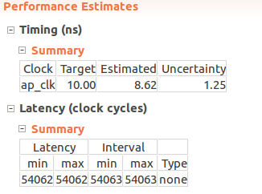
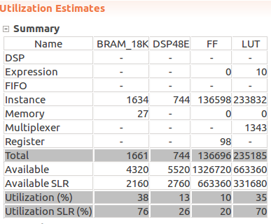

# lenet5-accelerator
This is the final project for [Special Course on Computer Architecture](http://www.am.ics.keio.ac.jp/comparc/), in which FPGA and GPU are used for acclerating a simple CNN LeNet-5. For FPGA and GPU, HLS and Cuda are used respectively.

Hardware info:
- CPU: Intel(R) Core(TM) i7-2600 CPU @ 3.40GHz
  - latency = 1.59ms/inference
- GPU: GeForce GTX 970
  - latency = 3.5ms (with a batch size of 100)
- FPGA: Xilinx Kintex Ultrascale
  - latency = 0.54ms/inference

For real-time application or inference of small batch size, FPGA is the fastest. 

## HLS
### Use the prepared code to generate HLS project
- run `vivado_hls -f build_prj.tcl` in this repo, and you'll have a synthesizale project.
### Or prepare the model from scratch...
- Train the model by running `keras_lenet.py`, which generates two things: `saved_model.json` and `saved_weights.h5`
- Clone into [this repo](https://github.com/sherylll/hls4ml), which is a fork of this great project [hls4ml](https://github.com/hls-fpga-machine-learning/hls4ml)
- `cd hls4ml/keras-to-hls`, create a new directory `lenet5-model-files`, and put the generated `saved_model.json` and `saved_weights.h5`
- `python keras-to-hls.py -c keras-config.yml`, which generates the C source files for the HLS project
- Build the HLS project by running `vivado_hls -f build_prj.tcl` (30~40 min)
  - There will be a lot of 1's printed out, which mean correct inferences. 0 means incorrect inference.
More information can be found in the [hls4ml](https://github.com/hls-fpga-machine-learning/hls4ml) repo. However the generated project without manual optimization can be not-synthesizable or have very poor performance.
### Testbench and test data
- testbench: `lenet5_test.cpp`
- test data: `test_images/` (generated by the script `test_images/save_images.py`) 
### Optimization tricks
- wrap inner loops into functions, such as the elementwise multiplication of a weight filter with a block of image. In 2d convolution, the innerest two loops are wrapped into one function, so that the filtering can be reused and pipelined.
- pipeline and partition at the same time:
```
for (int oh = 0; oh < CONFIG_T::out_height; oh++)
    for (int ow = 0; ow < CONFIG_T::out_width; ow++)
#pragma HLS pipeline
      for (int ff = 0; ff < CONFIG_T::n_filt; ff++)
        acc[oh * CONFIG_T::out_width + ow][ff] = biases[ff]; // partition acc in dim 2 and biases in dim 1
```
- use temporary variable to store the accumulation result to reduce memory access
- for fully-connected layers (matrix-vector multiplication), pipeline the first-level loop:
```
// keras (tf backend) uses transposed weight matrices
Product1: for(int ii = 0; ii < CONFIG_T::n_in; ii++) {
#pragma HLS PIPELINE
  cache = data[ii];
  Product2: for(int jj = 0; jj < CONFIG_T::n_out; jj++) {
    int index = ii*CONFIG_T::n_out+jj;
    typename CONFIG_T::accum_t mult = cache * weights[index];
    acc[jj] += mult;
  }
}
```
- remove unnecessary flatenning and unflatenning, match the dimension of the output of a layer and the input of the next layer.
- don't use local arrays too deep in the loop structure, which can result in large resource consumption

### Results
The original accuracy is 98.89% and using 16-bit fixed point (w/o the softmax layer), accuracy becomes to 98.87%. The softmax layer introduces a further tiny drop in the accuracy.

- xcku095-ffvb2104-1-c
  - latency = interval = 54064 cycles * 10 ns/cycle
  - resource usage
    - BRAM 49%
    - DSP 96%
    - FF 12%
    - LUT 46%
- xcku115-flvb2014-2-e:
  - latency: same as above

    

  - resource usage
  
    

## GPU
The code for GPU is located under `gpu`. Under the `gpu` directory, run `make cpu` or `make gpu` to build the CPU or GPU version of the code. The results are averaged over 100 samples.

The CPU/GPU coding style is very different from HLS, especially the convolution part, as can be learned from this project.

## Results
In this implementation, only the most expensive part (second conv layer) is moved to CUDA kernel, everything else stays in the host. 
Since there is a large overhead induced by the memory allocation and kernel launching, the overall latency averaged over 100 inferences is slightly worse than CPU (3.50 vs 1.59ms/inference). However if we compare the kernel only, GPU is abuot 40 times faster than CPU (0.225ms vs 9ms). This advantage only manifests itself when there is a large amount of data using the same parameters, which can be prefetched into GPU.

### Future work
It is also possible to implement the Cuda kernel as C++ templates, as explained in [this blog post](https://devblogs.nvidia.com/power-cpp11-cuda-7/). 

## LeNet5 in Keras 
For a comparison, the evaluation is done with Keras + TF:


The reduction in latency flattens out mainly due to limited memory on my laptop, if the CPU/GPU memory is large enough, the framework implementation will show even better scalability.

Note that the CPU/GPU used are different from above, which are Intel i7-7500 and GeForce 940MX, which is because I have the environment setup on my own laptop.